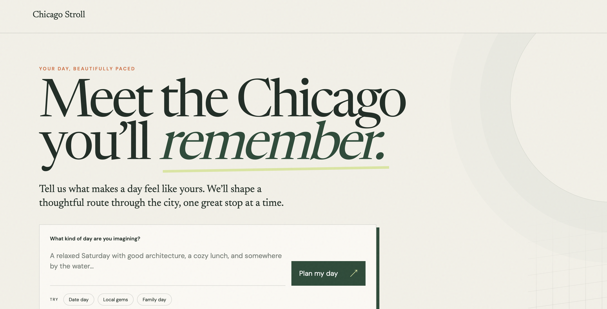
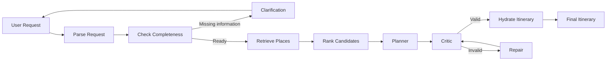

# Chicago Stroll   ༘⋆༄.°⋆

**A conversational AI planner for building personalized, constraint-aware days in Chicago.**

Chicago Stroll turns a natural-language request into a structured day itinerary by combining conversational intake, place retrieval and ranking, itinerary generation, deterministic validation, and automatic repair.

**[Live app →](https://chicago-stroll.vercel.app/)**

---

## What it does

Tell Chicago Stroll what kind of day you want:

> Plan a family day in Chicago from 11 AM to 8 PM, starting in Hyde Park and ending at Union Station. We like architecture, need vegetarian food, have a $150 budget, and prefer limited walking.

The planner:

1. extracts structured trip constraints from the request,
2. asks follow-up questions when required information is missing,
3. retrieves and ranks relevant Chicago places,
4. generates an itinerary using only retrieved candidates,
5. validates the plan against deterministic constraints,
6. repairs invalid plans when necessary, and
7. returns a hydrated itinerary with real place information.

---

## Demo

**Live:** [chicago-stroll.vercel.app](https://chicago-stroll.vercel.app/)


<p align="center">
  
</p>


---

## Architecture

Chicago Stroll is built as a stateful LangGraph workflow rather than a single LLM call.



The graph maintains conversation state across turns, allowing a user to provide an incomplete request and continue planning using the same thread.

---

## Engineering highlights

### Structured conversational intake

Natural-language requests are converted into a typed `TripRequest` containing constraints such as:

- date and time window
- start and end locations
- group type and size
- interests
- dietary preferences
- budget
- pace and walking tolerance
- preferred or excluded neighborhoods
- must-include and must-avoid preferences

The graph checks completeness before planning and generates a targeted clarification question when required information is missing.

### Retrieval before generation

The planner does not ask the model to invent Chicago destinations from scratch.

Place data is normalized, enriched with planner-oriented metadata, and ranked against the user's constraints before itinerary generation.

The LLM receives a constrained candidate set and references places through internal candidate IDs. A separate hydration layer resolves those IDs back to place records for the final API response.

This separates:

**retrieval → reasoning → validation → presentation**

and makes unsupported place selection detectable.

### Critic + repair loop

Generated itineraries pass through a validation stage before being returned.

The critic checks constraints including itinerary structure, candidate validity, chronology, travel feasibility, and user preferences. Invalid plans can be routed through a repair step and evaluated again before completion.

Warnings are preserved separately for conditions that should be surfaced without necessarily invalidating the itinerary.

### Model reliability

LLM calls use a shared invocation layer with:

- retries for transient API failures
- handling for retryable `429`, `503`, and `504` responses
- configurable primary and fallback models
- structured Pydantic outputs

This keeps model-provider reliability concerns separate from planner logic.

### Stateful API

The FastAPI layer exposes separate planning and continuation flows:

```text
POST /api/plan
POST /api/continue
GET  /api/health
```

A new planning request receives a thread ID. Follow-up answers reuse that ID so LangGraph can continue from the existing planning state.

---

## Evaluation

Chicago Stroll includes both unit/integration tests and a live end-to-end evaluation suite.

Current results on a **small four-case representative evaluation set**:

| Metric | Result |
|---|---:|
| Planning completion rate | **100%** |
| Valid itinerary rate | **100%** |
| Unknown candidate rate | **0%** |
| Average repairs | **0.00** |
| Average warnings | **0.50** |

The live suite covers different planning constraints, including architecture/family trips, vegetarian preferences, low-budget outdoor plans, and limited-walking itineraries.

These results are intended as regression/evaluation signals rather than a large-scale benchmark.

Run the live evaluations with:

```bash
python -m evals.run_live_evals
```

---

## Tech stack

| Layer | Technology |
|---|---|
| Agent orchestration | LangGraph |
| LLM integration | LangChain |
| Models | Google Gemini |
| Validation / schemas | Pydantic |
| API | FastAPI |
| Place data | Geoapify |
| Observability | LangSmith |
| Testing | pytest |
| Deployment | Vercel |
| Frontend | HTML, CSS, JavaScript |

---

## Project structure

```text
chicago-stroll/
│
├── agent/
│   ├── api/                  # Vercel API entrypoint
│   ├── app/
│   │   ├── api/              # FastAPI routes and models
│   │   ├── config/           # Model configuration
│   │   ├── graph/            # LangGraph workflow
│   │   ├── nodes/            # Graph nodes
│   │   ├── prompts/          # Planner / repair prompts
│   │   ├── schemas/          # Pydantic schemas
│   │   └── services/         # Retrieval, ranking, model invocation, hydration
│   │
│   ├── evals/                # Live end-to-end evaluations
│   ├── public/               # Web interface
│   ├── scripts/              # Development utilities
│   └── tests/                # Automated tests
│
└── README.md
```

---

## Running locally

### 1. Clone the repository

```bash
git clone https://github.com/jiyascript/chicago-stroll.git
cd chicago-stroll/agent
```

### 2. Create a virtual environment

```bash
python3 -m venv .venv
source .venv/bin/activate
```

### 3. Install dependencies

```bash
pip install -r requirements.txt
```

### 4. Configure environment variables

Create a `.env` file using `.env.example` as a template.

```env
GOOGLE_API_KEY=
GEOAPIFY_API_KEY=

GOOGLE_MODEL=
GOOGLE_FALLBACK_MODEL=

LANGSMITH_API_KEY=
LANGSMITH_TRACING=true
LANGSMITH_PROJECT=chicago-stroll
```

API keys should never be committed to the repository.

### 5. Run the application

```bash
uvicorn app.api.server:app --reload
```

Then open:

```text
http://127.0.0.1:8000
```

---

## Testing

Run the automated test suite:

```bash
python -m pytest
```

Run live planner evaluations:

```bash
python -m evals.run_live_evals
```

---

## Design principles

Chicago Stroll is built around a few constraints:

**Ground before generating.**  
The planner chooses from retrieved candidates rather than relying on unconstrained model recall.

**Use LLMs for reasoning, deterministic code for invariants.**  
Generation remains flexible while hard constraints can be checked explicitly.

**Treat failure as part of the workflow.**  
Invalid plans can be critiqued and repaired rather than silently returned.

**Keep provider reliability outside domain logic.**  
Retry and fallback behavior lives in a shared model-invocation layer.

**Preserve conversational state.**  
Planning can span multiple turns without rebuilding the request from scratch.

---

## Status

Chicago Stroll is an actively developed portfolio project.

Current functionality includes conversational intake, multi-turn clarification, place retrieval and ranking, structured itinerary generation, critic/repair validation, model fallback handling, automated evaluation, a FastAPI interface, and a deployed web experience.

Future work may include richer geographic routing, larger evaluation suites, real-time place availability, and additional retrieval providers.