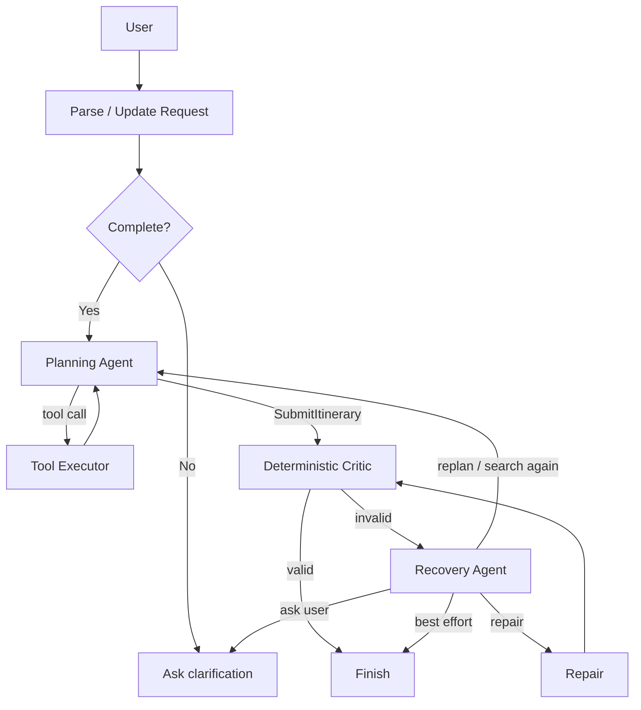

# Chicago Stroll v2

A bounded, tool-calling Chicago itinerary agent. The model chooses when to search live places, inspect place details, check travel time, check opening-hours evidence, or submit an itinerary. A deterministic critic validates hard constraints, and a model-directed recovery policy chooses whether to repair, replan, search again, ask the user, or return a best-effort result.

## Architecture



The model owns action selection; Python owns tool contracts, validation, and hard execution budgets.

## Live tools

- `SearchPlaces` — Geoapify Places API at request time.
- `GetPlaceDetails` — Geoapify Place Details API for selected candidates.
- `GetTravelTime` — Geoapify Routing API.
- `CheckHours` — evaluates returned opening-hours evidence conservatively; unknown stays unknown.
- `SubmitItinerary` — explicit structured completion action.

The static place repository is retained only as an offline/test fallback.

## Bounded autonomy

```text
MAX_PLANNER_STEPS = 8
MAX_TOOL_CALLS    = 12
MAX_REPAIRS       = 2
MAX_REPLANS       = 2
```

If a budget is exhausted, deterministic routing prevents another loop and escalates to `ask_user` or `best_effort`.

## Run locally

```bash
cd agent
python3 -m venv .venv
source .venv/bin/activate
pip install -r requirements.txt
cp .env.example .env
uvicorn app.api.server:app --reload
```

## Tests

```bash
cd agent
python -m pytest
```

Live agent evals (uses API/model quota):

```bash
python -m evals.run_live_evals
```

## Environment

See `agent/.env.example`. Never commit real keys.
